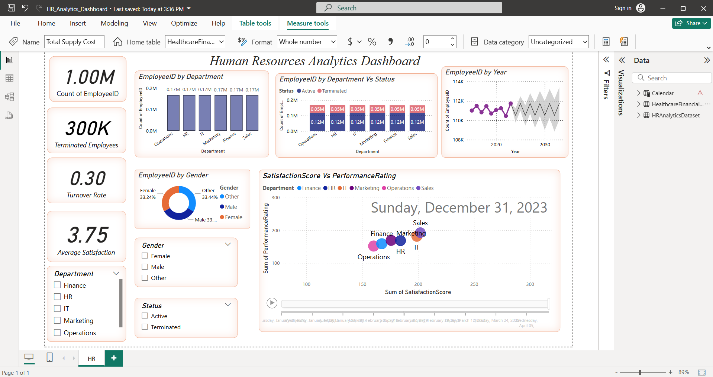

# CodeAlpha_HRAnalyticsDashboard

## Project: Human Resources Analytics Dashboard

### Objective:
To build a Power BI dashboard that enables HR professionals to track employee statistics, measure satisfaction, and forecast future workforce needs.

---

## Features:

- KPIs:
  - Total Employees
  - Terminated Employees
  - Turnover Rate
  - Average Satisfaction Score
- Visuals:
  - Employee count by department and gender
  - Status distribution (Active vs Terminated)
  - Performance Rating vs Satisfaction Score
  - Time-based hiring and termination trends
- Filters for:
  - Gender
  - Status
  - Department

---

## Tools Used:
- Power BI
- Mock HR dataset
- DAX for metrics and calculations

---

## Key Insights

### 1. **Employee Count**
- **Total Employees:** 1.00M
- **Terminated Employees:** 300K
- **Turnover Rate:** 0.30

### 2. **Average Satisfaction**
- **Overall Average Satisfaction Score:** 3.75 (out of 5)

### 3. **Department-wise Employee Distribution**
- Each department (Operations, HR, IT, Marketing, Finance, Sales) has approximately **170K** employees.
- Balanced staffing across departments.

### 4. **Gender Distribution**
- **Female:** 33.24%  
- **Male:** 33.32%  
- **Other:** 33.44%  
- Gender representation is nearly equal across categories, indicating diversity.

### 5. **Employee Status by Department**
- Every department shows a similar **Active to Terminated** ratio (e.g., ~0.12M Active vs. ~0.05M Terminated in each).

### 6. **Employee Trend Over Time**
- The number of employees remained relatively stable between 2018–2023.
- Future projections (2024–2030) show expected growth, with a forecast band indicating variance.

### 7. **Satisfaction vs. Performance (Scatter Plot)**
- Departments like **Sales** and **Marketing** show higher performance and satisfaction scores.
- **Operations** lags in both satisfaction and performance.
- Indicates where management interventions may be needed.

---

## Dax and Calculated Fields:

**Dax Fields:**

Average Satisfaction = AVERAGE(HRAnalyticsDataset[SatisfactionScore])

Terminated Employees = 
CALCULATE(
    COUNT(HRAnalyticsDataset[EmployeeID]),
    HRAnalyticsDataset[Status] = "Terminated"
)

Turnover Rate = 
DIVIDE(
    CALCULATE(COUNTROWS(HRAnalyticsDataset), HRAnalyticsDataset[Status] = "Terminated"),
    COUNTROWS(HRAnalyticsDataset)
)

**Calculated Fields:**

AttritionFlag = IF([Status] = "Terminated", 1, 0)

TenureYears = 
DIVIDE(
    DATEDIFF([HireDate], 
        IF(ISBLANK([ExitDate]), TODAY(), [ExitDate]), 
    DAY),
    365
)

---

## Screenshots:

---

## LinkedIn Post:
[View My LinkedIn Submission]()

## GitHub Repository:
[View Repository](https://github.com/ArchanaKandi/CodeAlpha_HRAnalyticsDashboard)
